# CHƯƠNG 2. PHÂN TÍCH THIẾT KẾ HỆ THỐNG

## 2.1 Biểu đồ Use Case

### 2.1.1 Biểu đồ Use Case tổng quát

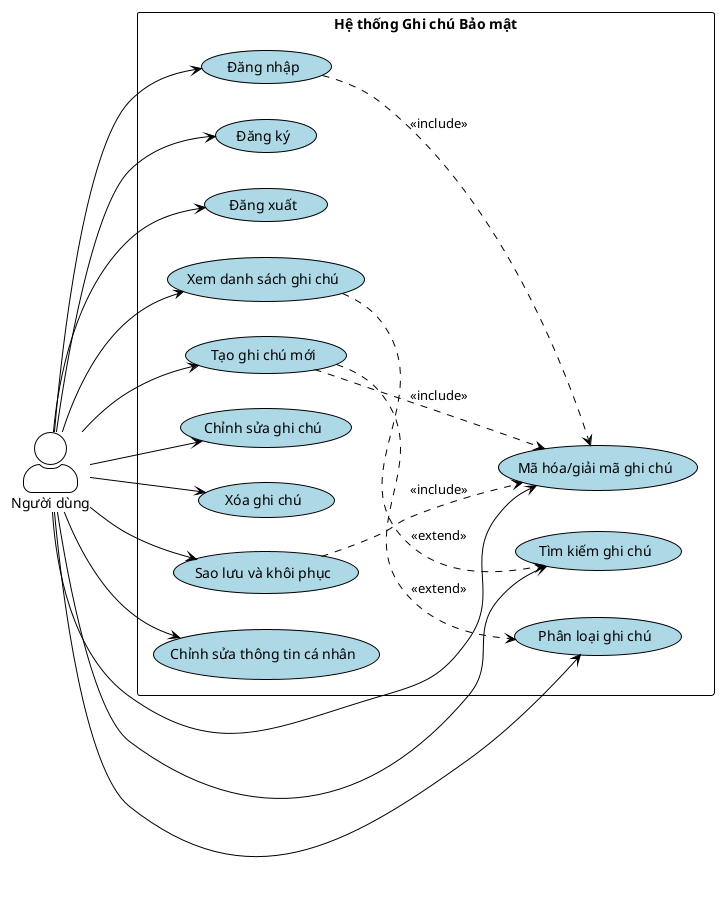

## 2.2 Đặc tả Use Case

### Use Case UC1: Đăng nhập

**Mô tả:** Người dùng đăng nhập vào hệ thống với xác thực hai yếu tố (2FA) hoặc bằng sinh trắc học.

**Actor:** Người dùng

**Điều kiện tiên quyết:** Người dùng đã có tài khoản và đã thiết lập 2FA

**Luồng sự kiện chính - Đăng nhập với 2FA:**
1. Người dùng chọn "Đăng nhập"
2. Hệ thống hiển thị form đăng nhập
3. Người dùng nhập username/email và mật khẩu
4. Hệ thống xác thực thông tin đăng nhập
5. Hệ thống kiểm tra 2FA đã được bật
6. Hệ thống yêu cầu mã 2FA
7. Người dùng nhập mã 2FA từ ứng dụng authenticator
8. Hệ thống xác thực mã 2FA
9. Hệ thống tạo JWT access token và refresh token
10. Hệ thống lưu refresh token vào database
11. Hệ thống chuyển người dùng đến trang chủ

**Luồng sự kiện chính - Đăng nhập bằng sinh trắc học:**
1. Người dùng chọn "Đăng nhập bằng vân tay/Face ID"
2. Hệ thống yêu cầu xác thực sinh trắc học
3. Người dùng xác thực bằng vân tay/Face ID
4. Hệ thống lấy backup code đã lưu từ secure storage
5. Hệ thống gửi backup code kèm username đến server
6. Hệ thống xác thực backup code
7. Hệ thống tạo JWT tokens
8. Hệ thống chuyển người dùng đến trang chủ

**Luồng sự kiện thay thế:**
- 4a. Thông tin đăng nhập sai: Hệ thống thông báo lỗi, yêu cầu nhập lại
- 5a. 2FA chưa được bật: Hệ thống yêu cầu thiết lập 2FA trước
- 8a. Mã 2FA sai: Hệ thống thông báo lỗi, cho phép nhập lại hoặc sử dụng backup code
- 8b. Người dùng sử dụng backup code: Hệ thống xác thực và xóa backup code đã dùng
- 3a. Xác thực sinh trắc học thất bại: Hệ thống thông báo lỗi, yêu cầu thử lại
- 6a. Backup code không hợp lệ: Hệ thống thông báo lỗi, yêu cầu đăng nhập lại

**Điều kiện sau:** Người dùng đã đăng nhập, có quyền truy cập hệ thống

---

### Use Case UC2: Đăng ký

**Mô tả:** Người dùng mới đăng ký tài khoản trong hệ thống.

**Actor:** Người dùng

**Điều kiện tiên quyết:** Người dùng chưa có tài khoản

**Luồng sự kiện chính:**
1. Người dùng chọn "Đăng ký"
2. Hệ thống hiển thị form đăng ký
3. Người dùng nhập thông tin:
   - Tên đăng nhập (username)
   - Email
   - Mật khẩu
   - Xác nhận mật khẩu
4. Hệ thống kiểm tra tính hợp lệ:
   - Username chưa tồn tại
   - Email chưa được sử dụng
   - Mật khẩu đáp ứng yêu cầu
5. Hệ thống hash mật khẩu bằng bcrypt
6. Hệ thống tạo khóa mã hóa AES-256 cho người dùng
7. Hệ thống mã hóa khóa người dùng bằng master key
8. Hệ thống tạo tài khoản mới
9. Hệ thống thông báo đăng ký thành công

**Luồng sự kiện thay thế:**
- 4a. Username đã tồn tại: Hệ thống thông báo lỗi, yêu cầu chọn username khác
- 4b. Email đã được sử dụng: Hệ thống thông báo lỗi, yêu cầu sử dụng email khác
- 4c. Mật khẩu không đáp ứng yêu cầu: Hệ thống thông báo yêu cầu mật khẩu

**Điều kiện sau:** Người dùng đã có tài khoản, cần thiết lập 2FA để sử dụng

---

### Use Case UC3: Tìm kiếm ghi chú

**Mô tả:** Người dùng tìm kiếm ghi chú theo từ khóa.

**Actor:** Người dùng

**Điều kiện tiên quyết:** Người dùng đã đăng nhập

**Luồng sự kiện chính:**
1. Người dùng nhập từ khóa vào ô tìm kiếm
2. Hệ thống lấy danh sách ghi chú của người dùng
3. Hệ thống giải mã tiêu đề và nội dung của từng ghi chú
4. Hệ thống tìm kiếm từ khóa trong tiêu đề và nội dung đã giải mã
5. Hệ thống hiển thị kết quả tìm kiếm

**Luồng sự kiện thay thế:**
- 1a. Từ khóa rỗng: Hệ thống hiển thị tất cả ghi chú
- 3a. Lỗi giải mã: Hệ thống bỏ qua ghi chú đó

**Điều kiện sau:** Người dùng đã xem kết quả tìm kiếm

---

### Use Case UC4: Xem danh sách ghi chú

**Mô tả:** Người dùng xem danh sách tất cả ghi chú của mình.

**Actor:** Người dùng

**Điều kiện tiên quyết:** Người dùng đã đăng nhập

**Luồng sự kiện chính:**
1. Người dùng truy cập trang chủ
2. Hệ thống lấy danh sách ghi chú của người dùng từ database
3. Hệ thống lấy khóa mã hóa của người dùng
4. Hệ thống giải mã tiêu đề của từng ghi chú
5. Hệ thống hiển thị danh sách ghi chú với tiêu đề đã giải mã
6. Người dùng có thể lọc theo phân loại, thẻ, yêu thích
7. Người dùng có thể tìm kiếm trong danh sách

**Luồng sự kiện thay thế:**
- 4a. Lỗi giải mã: Hệ thống bỏ qua ghi chú đó, hiển thị cảnh báo

**Điều kiện sau:** Người dùng đã xem danh sách ghi chú

---

### Use Case UC5: Đăng xuất

**Mô tả:** Người dùng đăng xuất khỏi hệ thống.

**Actor:** Người dùng

**Điều kiện tiên quyết:** Người dùng đã đăng nhập

**Luồng sự kiện chính:**
1. Người dùng chọn "Đăng xuất"
2. Hệ thống xóa tất cả refresh token của người dùng
3. Hệ thống xóa access token khỏi client
4. Hệ thống chuyển người dùng đến trang đăng nhập

**Điều kiện sau:** Người dùng đã đăng xuất, không còn quyền truy cập

---

### Use Case UC6: Tạo ghi chú mới

**Mô tả:** Người dùng tạo một ghi chú mới với nội dung được mã hóa. Có thể tạo từ văn bản hoặc từ ảnh (OCR).

**Actor:** Người dùng

**Điều kiện tiên quyết:** Người dùng đã đăng nhập

**Luồng sự kiện chính:**
1. Người dùng chọn "Tạo ghi chú mới"
2. Hệ thống hiển thị form tạo ghi chú
3. Người dùng có thể:
   - Nhập tiêu đề và nội dung trực tiếp, hoặc
   - Chọn ảnh để trích xuất văn bản bằng OCR
4. Nếu chọn OCR:
   - Người dùng chọn ảnh từ thiết bị
   - Hệ thống kiểm tra định dạng và kích thước ảnh (tối đa 10MB)
   - Hệ thống gửi ảnh đến OCR service
   - OCR service trích xuất văn bản từ ảnh
   - Hệ thống sử dụng AI để tạo tiêu đề từ nội dung
   - Hệ thống hiển thị tiêu đề và nội dung đã trích xuất
5. Người dùng có thể chỉnh sửa tiêu đề và nội dung
6. Người dùng có thể chọn phân loại (category) và thẻ (tags)
7. Người dùng chọn "Lưu"
8. Hệ thống lấy khóa mã hóa của người dùng
9. Hệ thống mã hóa tiêu đề bằng AES-256-GCM
10. Hệ thống mã hóa nội dung bằng AES-256-GCM
11. Hệ thống lưu ghi chú đã mã hóa vào database
12. Hệ thống thông báo tạo ghi chú thành công

**Luồng sự kiện thay thế:**
- 3a. Người dùng không nhập tiêu đề: Hệ thống yêu cầu nhập tiêu đề
- 4a. Ảnh không hợp lệ: Hệ thống thông báo lỗi, yêu cầu chọn ảnh khác
- 4b. Ảnh quá lớn: Hệ thống thông báo lỗi, yêu cầu chọn ảnh nhỏ hơn
- 4c. Lỗi OCR: Hệ thống thông báo lỗi, yêu cầu thử lại
- 9a. Lỗi mã hóa: Hệ thống thông báo lỗi, yêu cầu thử lại

**Điều kiện sau:** Ghi chú mới đã được tạo và mã hóa trong database

---

### Use Case UC7: Chỉnh sửa ghi chú

**Mô tả:** Người dùng chỉnh sửa nội dung của một ghi chú đã tồn tại.

**Actor:** Người dùng

**Điều kiện tiên quyết:** Người dùng đã đăng nhập, ghi chú tồn tại và người dùng có quyền chỉnh sửa

**Luồng sự kiện chính:**
1. Người dùng chọn ghi chú cần chỉnh sửa
2. Người dùng chọn "Chỉnh sửa"
3. Hệ thống giải mã và hiển thị nội dung hiện tại
4. Người dùng chỉnh sửa tiêu đề và/hoặc nội dung
5. Người dùng có thể thay đổi phân loại và thẻ
6. Người dùng chọn "Lưu"
7. Hệ thống mã hóa lại tiêu đề và nội dung mới
8. Hệ thống cập nhật ghi chú trong database
9. Hệ thống cập nhật thời gian chỉnh sửa
10. Hệ thống thông báo cập nhật thành công

**Luồng sự kiện thay thế:**
- 2a. Người dùng không có quyền chỉnh sửa: Hệ thống từ chối, chỉ cho phép xem
- 7a. Lỗi mã hóa: Hệ thống thông báo lỗi, yêu cầu thử lại

**Điều kiện sau:** Ghi chú đã được cập nhật với nội dung mới đã mã hóa

---

### Use Case UC8: Xóa ghi chú

**Mô tả:** Người dùng xóa một ghi chú (soft delete - chuyển vào thùng rác) hoặc xóa vĩnh viễn.

**Actor:** Người dùng

**Điều kiện tiên quyết:** Người dùng đã đăng nhập, ghi chú tồn tại và người dùng sở hữu

**Luồng sự kiện chính - Xóa vào thùng rác:**
1. Người dùng chọn ghi chú cần xóa
2. Người dùng chọn "Xóa"
3. Hệ thống yêu cầu xác nhận
4. Người dùng xác nhận xóa
5. Hệ thống đánh dấu ghi chú là đã xóa (is_deleted = true)
6. Hệ thống lưu thời gian xóa (deleted_at)
7. Hệ thống chuyển ghi chú vào thùng rác
8. Hệ thống thông báo xóa thành công

**Luồng sự kiện chính - Xóa vĩnh viễn:**
1. Người dùng truy cập thùng rác
2. Người dùng chọn ghi chú cần xóa vĩnh viễn
3. Người dùng chọn "Xóa vĩnh viễn"
4. Hệ thống yêu cầu xác nhận (cảnh báo không thể khôi phục)
5. Người dùng xác nhận
6. Hệ thống xóa vĩnh viễn ghi chú khỏi database
7. Hệ thống xóa các bản ghi liên quan (tags, shared_notes)
8. Hệ thống thông báo xóa vĩnh viễn thành công

**Luồng sự kiện thay thế:**
- 3a. Người dùng hủy: Hệ thống không xóa, quay lại màn hình trước
- 4a. Người dùng hủy (xóa vĩnh viễn): Hệ thống không xóa, quay lại màn hình trước

**Điều kiện sau:** Ghi chú đã được chuyển vào thùng rác hoặc xóa vĩnh viễn

---

### Use Case UC9: Phân loại ghi chú (thư mục/tag)

**Mô tả:** Người dùng tổ chức ghi chú bằng cách sử dụng phân loại (category) và thẻ (tag).

**Actor:** Người dùng

**Điều kiện tiên quyết:** Người dùng đã đăng nhập

**Luồng sự kiện chính:**
1. Người dùng tạo phân loại hoặc thẻ mới
2. Người dùng gắn phân loại/thẻ vào ghi chú khi tạo hoặc chỉnh sửa
3. Hệ thống lưu thông tin phân loại/thẻ vào database
4. Người dùng có thể lọc ghi chú theo phân loại hoặc thẻ
5. Người dùng có thể quản lý (chỉnh sửa, xóa) phân loại và thẻ

**Điều kiện sau:** Ghi chú đã được tổ chức bằng phân loại và thẻ

---

### Use Case UC10: Mã hóa/giải mã ghi chú

**Mô tả:** Hệ thống tự động mã hóa và giải mã ghi chú để đảm bảo bảo mật.

**Actor:** Hệ thống (tự động)

**Điều kiện tiên quyết:** Người dùng đã đăng nhập, có khóa mã hóa

**Luồng sự kiện chính:**
1. Khi tạo/chỉnh sửa ghi chú:
   - Hệ thống lấy khóa mã hóa của người dùng
   - Hệ thống mã hóa tiêu đề và nội dung bằng AES-256-GCM
   - Hệ thống lưu dữ liệu đã mã hóa vào database
2. Khi xem ghi chú:
   - Hệ thống lấy khóa mã hóa của người dùng
   - Hệ thống giải mã tiêu đề và nội dung
   - Hệ thống hiển thị dữ liệu đã giải mã cho người dùng

**Luồng sự kiện thay thế:**
- 1a. Lỗi mã hóa: Hệ thống thông báo lỗi, không lưu ghi chú
- 2a. Lỗi giải mã: Hệ thống thông báo lỗi, không thể hiển thị ghi chú

**Điều kiện sau:** Ghi chú đã được mã hóa khi lưu và giải mã khi hiển thị

---

### Use Case UC11: Sao lưu và khôi phục

**Mô tả:** Người dùng sao lưu dữ liệu ghi chú và khôi phục khi cần thiết. Có thể khôi phục ghi chú từ thùng rác.

**Actor:** Người dùng

**Điều kiện tiên quyết:** Người dùng đã đăng nhập

**Luồng sự kiện chính - Sao lưu:**
1. Người dùng chọn "Sao lưu dữ liệu"
2. Hệ thống lấy tất cả ghi chú của người dùng
3. Hệ thống giải mã dữ liệu bằng khóa của người dùng
4. Hệ thống tạo file sao lưu (JSON hoặc định dạng khác)
5. Hệ thống mã hóa file sao lưu
6. Người dùng tải file sao lưu về thiết bị
7. Hệ thống lưu thông tin sao lưu vào database

**Luồng sự kiện chính - Khôi phục từ file:**
1. Người dùng chọn "Khôi phục dữ liệu"
2. Người dùng chọn file sao lưu từ thiết bị
3. Hệ thống giải mã file sao lưu
4. Hệ thống kiểm tra tính hợp lệ của file
5. Hệ thống mã hóa lại dữ liệu bằng khóa hiện tại của người dùng
6. Hệ thống khôi phục ghi chú vào database
7. Hệ thống thông báo khôi phục thành công

**Luồng sự kiện chính - Khôi phục từ thùng rác:**
1. Người dùng truy cập thùng rác
2. Người dùng chọn ghi chú cần khôi phục
3. Người dùng chọn "Khôi phục"
4. Hệ thống đánh dấu ghi chú là chưa xóa (is_deleted = false)
5. Hệ thống xóa thời gian xóa (deleted_at = null)
6. Hệ thống chuyển ghi chú về danh sách chính
7. Hệ thống thông báo khôi phục thành công

**Luồng sự kiện thay thế:**
- 3a. Lỗi giải mã file sao lưu: Hệ thống thông báo lỗi, file không hợp lệ
- 4a. File sao lưu không hợp lệ: Hệ thống thông báo lỗi, yêu cầu chọn file khác
- 5a. Lỗi mã hóa: Hệ thống thông báo lỗi, không thể khôi phục

**Điều kiện sau:** Dữ liệu đã được sao lưu hoặc khôi phục thành công

---

### Use Case UC12: Chỉnh sửa thông tin cá nhân

**Mô tả:** Người dùng cập nhật thông tin cá nhân (username, email), đổi mật khẩu và cài đặt bảo mật.

**Actor:** Người dùng

**Điều kiện tiên quyết:** Người dùng đã đăng nhập

**Luồng sự kiện chính - Cập nhật thông tin:**
1. Người dùng truy cập màn hình "Hồ sơ"
2. Người dùng chọn "Chỉnh sửa"
3. Người dùng cập nhật thông tin (username, email)
4. Hệ thống kiểm tra tính hợp lệ (username/email chưa được sử dụng)
5. Hệ thống cập nhật thông tin trong database
6. Hệ thống thông báo cập nhật thành công

**Luồng sự kiện chính - Đổi mật khẩu:**
1. Người dùng truy cập màn hình "Cài đặt bảo mật"
2. Người dùng chọn "Đổi mật khẩu"
3. Người dùng nhập mật khẩu hiện tại
4. Người dùng nhập mật khẩu mới
5. Người dùng xác nhận mật khẩu mới
6. Hệ thống xác thực mật khẩu hiện tại
7. Hệ thống kiểm tra mật khẩu mới đáp ứng yêu cầu
8. Hệ thống hash mật khẩu mới bằng bcrypt
9. Hệ thống cập nhật mật khẩu trong database
10. Hệ thống xóa tất cả refresh token (invalidate all tokens)
11. Hệ thống thông báo đổi mật khẩu thành công

**Luồng sự kiện chính - Cài đặt bảo mật:**
1. Người dùng truy cập màn hình "Cài đặt bảo mật"
2. Người dùng có thể:
   - Thiết lập/bật/tắt 2FA
   - Bật/tắt đăng nhập sinh trắc học
   - Xem backup codes
3. Người dùng chọn tùy chọn cần thay đổi
4. Hệ thống xác thực (nếu cần mật khẩu)
5. Hệ thống cập nhật cài đặt
6. Hệ thống thông báo cập nhật thành công

**Luồng sự kiện thay thế:**
- 4a. Username/email đã tồn tại: Hệ thống thông báo lỗi, yêu cầu chọn giá trị khác
- 6a. Mật khẩu hiện tại sai: Hệ thống thông báo lỗi, yêu cầu nhập lại
- 7a. Mật khẩu mới không đáp ứng yêu cầu: Hệ thống thông báo yêu cầu mật khẩu

**Điều kiện sau:** Thông tin cá nhân, mật khẩu hoặc cài đặt bảo mật đã được cập nhật


---

## 2.3 Biểu đồ tuần tự

### 2.3.1 Biểu đồ tuần tự - Đăng nhập

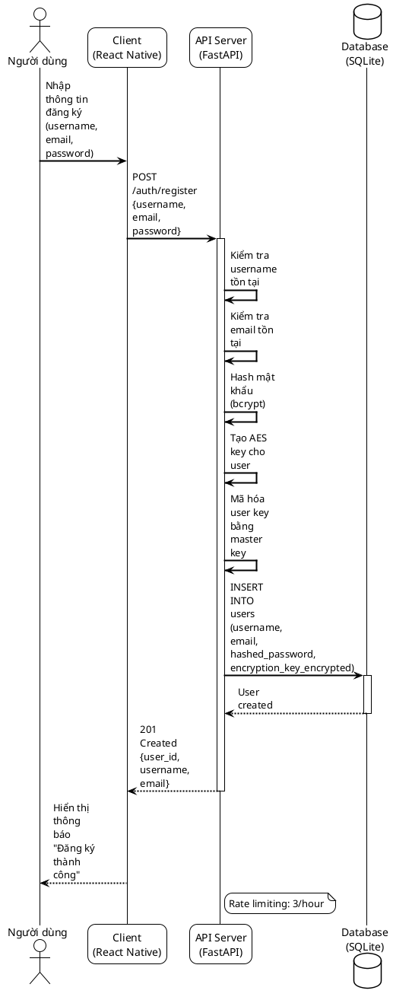

### 2.3.2 Biểu đồ tuần tự - Đăng ký

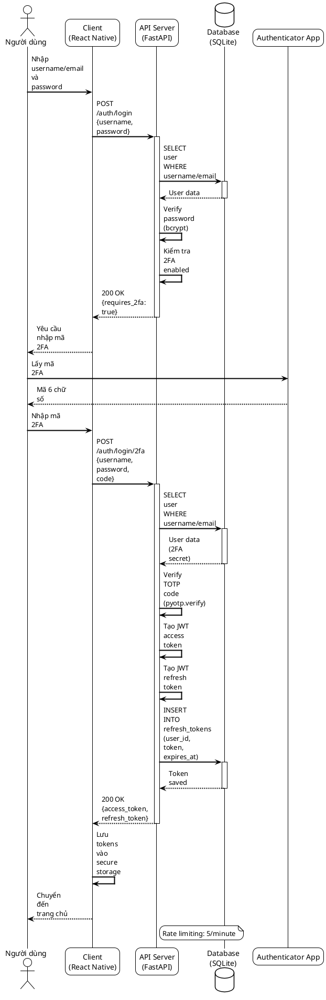

### 2.3.3 Biểu đồ tuần tự - Tìm kiếm ghi chú

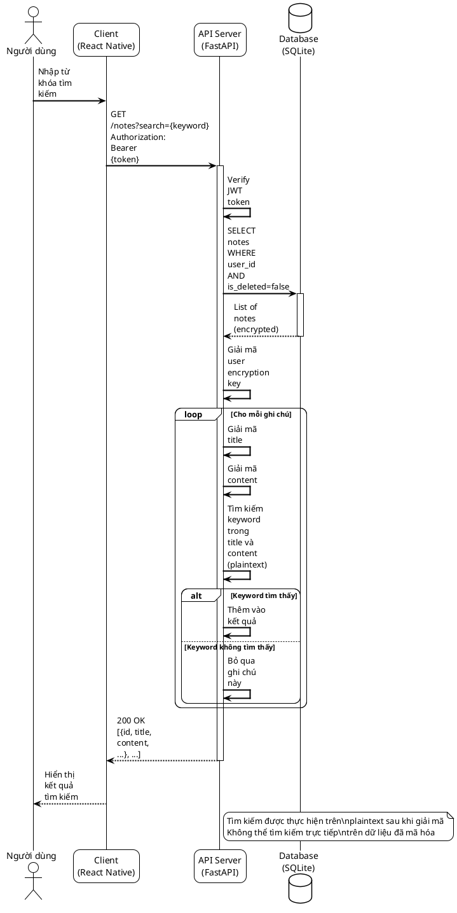

### 2.3.4 Biểu đồ tuần tự - Xem danh sách ghi chú

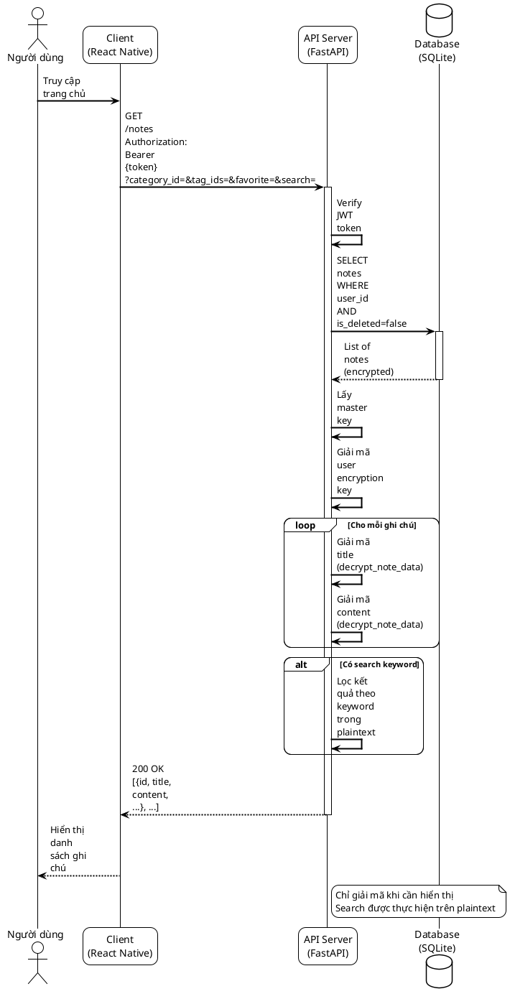

### 2.3.5 Biểu đồ tuần tự - Tạo ghi chú mới

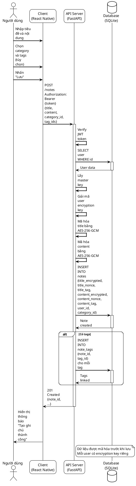

### 2.3.6 Biểu đồ tuần tự - Chỉnh sửa ghi chú

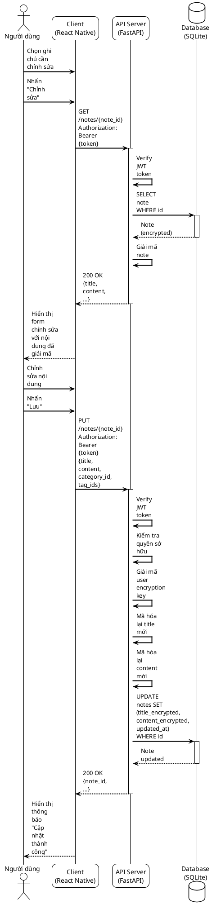

### 2.3.7 Biểu đồ tuần tự - Xóa ghi chú

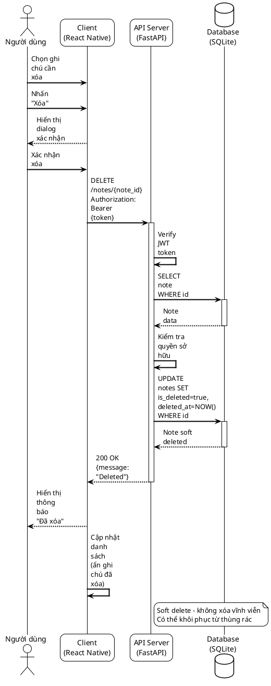

### 2.3.8 Biểu đồ tuần tự - Mã hóa/giải mã ghi chú

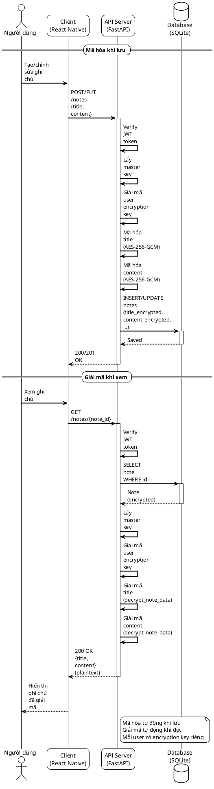

### 2.3.9 Biểu đồ tuần tự - Phân loại ghi chú

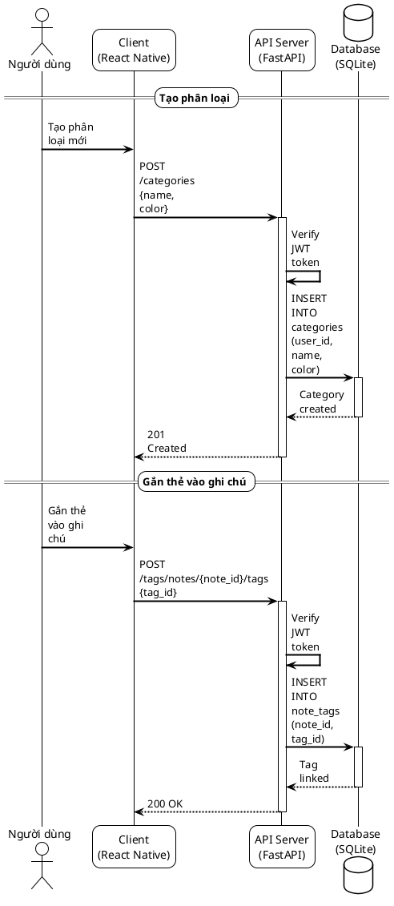

### 2.3.10 Biểu đồ tuần tự - Sao lưu dữ liệu

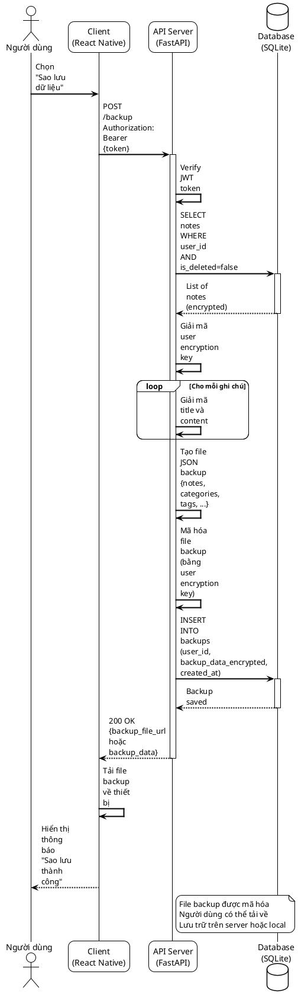

### 2.3.11 Biểu đồ tuần tự - Khôi phục dữ liệu

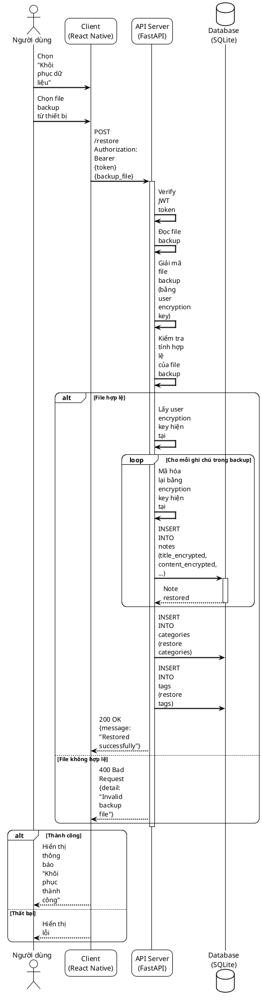

### 2.3.12 Biểu đồ tuần tự - Chỉnh sửa thông tin cá nhân

```plantuml
@startuml
!theme plain
skinparam sequenceArrowThickness 2
skinparam roundcorner 20
skinparam maxmessagesize 60

actor "Người dùng" as User
participant "Client\n(React Native)" as Client
participant "API Server\n(FastAPI)" as Server
database "Database\n(SQLite)" as DB

== Cập nhật thông tin cá nhân ==
User -> Client: Truy cập "Hồ sơ"
User -> Client: Chọn "Chỉnh sửa"
User -> Client: Cập nhật username/email
User -> Client: Nhấn "Lưu"

Client -> Server: PUT /users/me\nAuthorization: Bearer {token}\n{username, email}
activate Server

Server -> Server: Verify JWT token
Server -> DB: SELECT user WHERE id
activate DB
DB --> Server: User data
deactivate DB

Server -> Server: Kiểm tra username/email\nchưa được sử dụng

alt Hợp lệ
    Server -> DB: UPDATE users SET\nusername, email WHERE id
    activate DB
    DB --> Server: User updated
    deactivate DB
    Server --> Client: 200 OK\n{user_id, username, email}
else Đã tồn tại
    Server --> Client: 400 Bad Request\n{detail: "Username/Email already taken"}
end
deactivate Server

alt Thành công
    Client --> User: Hiển thị thông báo\n"Cập nhật thành công"
else Thất bại
    Client --> User: Hiển thị lỗi
end

== Đổi mật khẩu ==
User -> Client: Truy cập "Cài đặt bảo mật"
User -> Client: Chọn "Đổi mật khẩu"
User -> Client: Nhập mật khẩu hiện tại
User -> Client: Nhập mật khẩu mới
User -> Client: Xác nhận mật khẩu mới
User -> Client: Nhấn "Lưu"

Client -> Server: PUT /users/me/password\nAuthorization: Bearer {token}\n{current_password, new_password}
activate Server

Server -> Server: Verify JWT token
Server -> DB: SELECT user WHERE id
activate DB
DB --> Server: User data (hashed_password)
deactivate DB

Server -> Server: Verify current password\n(bcrypt.verify)
alt Mật khẩu hiện tại đúng
    Server -> Server: Hash mật khẩu mới\n(bcrypt.hash)
    Server -> DB: UPDATE users SET\nhashed_password WHERE id
    Server -> DB: DELETE refresh_tokens\nWHERE user_id (invalidate all tokens)
    activate DB
    DB --> Server: Password updated
    deactivate DB
    Server --> Client: 200 OK\n{message: "Password changed"}
else Mật khẩu hiện tại sai
    Server --> Client: 401 Unauthorized\n{detail: "Incorrect password"}
end
deactivate Server

alt Thành công
    Client --> User: Hiển thị thông báo\n"Đổi mật khẩu thành công"
else Thất bại
    Client --> User: Hiển thị lỗi\n"Mật khẩu hiện tại không đúng"
end

== Cài đặt bảo mật ==
User -> Client: Truy cập "Cài đặt bảo mật"
User -> Client: Chọn tùy chọn (2FA, sinh trắc học)
User -> Client: Nhấn "Lưu"

alt Bật/tắt 2FA
    Client -> Server: POST /2fa/enable hoặc /2fa/disable\nAuthorization: Bearer {token}
    activate Server
    Server -> Server: Verify JWT token
    Server -> DB: UPDATE users SET\ntwo_factor_enabled WHERE id
    activate DB
    DB --> Server: Settings updated
    deactivate DB
    Server --> Client: 200 OK
    deactivate Server
else Bật/tắt sinh trắc học
    Client -> Server: POST /biometric/enable hoặc /biometric/disable\nAuthorization: Bearer {token}
    activate Server
    Server -> Server: Verify JWT token
    Server -> DB: UPDATE users SET\nbiometric_enabled WHERE id
    activate DB
    DB --> Server: Settings updated
    deactivate DB
    Server --> Client: 200 OK
    deactivate Server
end

Client --> User: Hiển thị thông báo\n"Cài đặt đã được cập nhật"

@enduml
```

@startuml
!theme plain
skinparam sequenceArrowThickness 2
skinparam roundcorner 20
skinparam maxmessagesize 60

actor "Người dùng" as User
participant "Client\n(React Native)" as Client
participant "API Server\n(FastAPI)" as Server
database "Database\n(SQLite)" as DB
participant "Authenticator App" as AuthApp

User -> Client: Truy cập "Cài đặt bảo mật"
User -> Client: Chọn "Thiết lập 2FA"

Client -> Server: POST /auth/2fa/setup\nAuthorization: Bearer {token}\n(hoặc /auth/2fa/setup-new cho user mới)
activate Server

Server -> Server: Verify JWT token
Server -> Server: Tạo TOTP secret\n(pyotp.random_base32)
Server -> Server: Tạo QR code URL\n(pyotp.provisioning_uri)
Server -> Server: Tạo 10 backup codes
Server -> Server: Hash backup codes\n(bcrypt)

Server -> DB: UPDATE users SET\ntwo_factor_secret, two_factor_backup_codes\nWHERE id
activate DB
DB --> Server: User updated
deactivate DB

Server --> Client: 200 OK\n{secret, qr_code_url, backup_codes}
deactivate Server

Client --> User: Hiển thị QR code và\nbackup codes

User -> AuthApp: Quét QR code
AuthApp --> User: Đã thêm tài khoản
User -> AuthApp: Lấy mã 2FA đầu tiên
AuthApp --> User: Mã 6 chữ số
User -> Client: Nhập mã 2FA để xác nhận

Client -> Server: POST /auth/2fa/enable\nAuthorization: Bearer {token}\n{code}\n(hoặc /auth/2fa/enable-new cho user mới)
activate Server

Server -> Server: Verify JWT token
Server -> DB: SELECT user WHERE id
activate DB
DB --> Server: User (two_factor_secret)
deactivate DB

Server -> Server: Verify TOTP code\n(pyotp.verify)

alt Mã 2FA đúng
    Server -> DB: UPDATE users SET\ntwo_factor_enabled=true WHERE id
    activate DB
    DB --> Server: 2FA enabled
    deactivate DB
    Server --> Client: 200 OK\n{message: "2FA enabled"}
else Mã 2FA sai
    Server --> Client: 400 Bad Request\n{detail: "Invalid 2FA code"}
end
deactivate Server

alt Thành công
    Client --> User: Hiển thị thông báo\n"2FA đã được kích hoạt"
else Thất bại
    Client --> User: Hiển thị lỗi\n"Mã 2FA không đúng"
end

note right of Server
  Backup codes chỉ hiển thị một lần
  Người dùng cần lưu lại backup codes
end note

@enduml
```

---

## 2.4 Thiết kế cơ sở dữ liệu

### 2.4.1 Sơ đồ kết nối các bảng (ER Diagram)

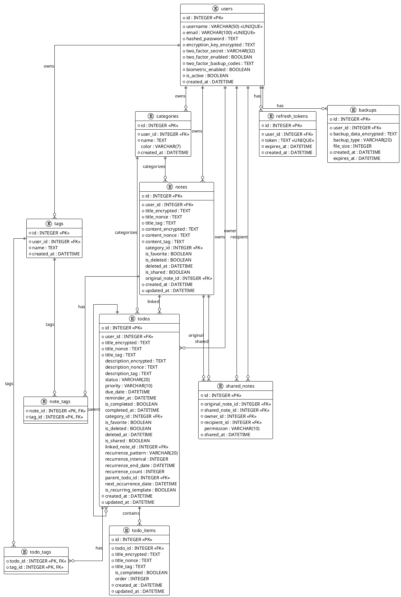

### 2.4.2 Cấu trúc bảng

#### Bảng `users` (Người dùng)

Bảng này lưu trữ thông tin người dùng và các cài đặt bảo mật.

| Tên cột | Kiểu dữ liệu | Ràng buộc | Mô tả |
|---------|--------------|-----------|-------|
| id | INTEGER | PRIMARY KEY, AUTO INCREMENT | ID duy nhất của người dùng |
| username | VARCHAR(50) | NOT NULL, UNIQUE, INDEX | Tên đăng nhập |
| email | VARCHAR(100) | NOT NULL, UNIQUE, INDEX | Email |
| hashed_password | TEXT | NOT NULL | Mật khẩu đã hash bằng bcrypt |
| encryption_key_encrypted | TEXT | NOT NULL | Khóa mã hóa AES của người dùng, được mã hóa bằng master key |
| two_factor_secret | VARCHAR(32) | NULL | Secret key cho TOTP (base32) |
| two_factor_enabled | BOOLEAN | DEFAULT FALSE, INDEX | Trạng thái bật/tắt 2FA |
| two_factor_backup_codes | TEXT | NULL | Backup codes đã hash (JSON array) |
| biometric_enabled | BOOLEAN | DEFAULT FALSE | Trạng thái bật/tắt đăng nhập sinh trắc học |
| is_active | BOOLEAN | DEFAULT TRUE | Trạng thái kích hoạt tài khoản |
| created_at | DATETIME | NOT NULL, DEFAULT NOW() | Thời gian tạo tài khoản |

**Ràng buộc:**
- `username` và `email` phải duy nhất
- `hashed_password` và `encryption_key_encrypted` không được NULL

---

#### Bảng `notes` (Ghi chú)

Bảng này lưu trữ các ghi chú đã được mã hóa.

| Tên cột | Kiểu dữ liệu | Ràng buộc | Mô tả |
|---------|--------------|-----------|-------|
| id | INTEGER | PRIMARY KEY, AUTO INCREMENT | ID duy nhất của ghi chú |
| user_id | INTEGER | NOT NULL, FOREIGN KEY → users.id | ID người sở hữu ghi chú |
| title_encrypted | TEXT | NOT NULL | Tiêu đề đã mã hóa (AES-256-GCM) |
| title_nonce | TEXT | NOT NULL | Nonce cho tiêu đề |
| title_tag | TEXT | NOT NULL | Authentication tag cho tiêu đề |
| content_encrypted | TEXT | NOT NULL | Nội dung đã mã hóa (AES-256-GCM) |
| content_nonce | TEXT | NOT NULL | Nonce cho nội dung |
| content_tag | TEXT | NOT NULL | Authentication tag cho nội dung |
| category_id | INTEGER | NULL, FOREIGN KEY → categories.id | ID phân loại |
| is_favorite | BOOLEAN | DEFAULT FALSE | Đánh dấu yêu thích |
| is_deleted | BOOLEAN | DEFAULT FALSE | Trạng thái xóa (soft delete) |
| deleted_at | DATETIME | NULL | Thời gian xóa |
| is_shared | BOOLEAN | DEFAULT FALSE | Trạng thái chia sẻ |
| original_note_id | INTEGER | NULL, FOREIGN KEY → notes.id | ID ghi chú gốc (nếu là bản sao) |
| created_at | DATETIME | NOT NULL, DEFAULT NOW() | Thời gian tạo |
| updated_at | DATETIME | NOT NULL, DEFAULT NOW() | Thời gian cập nhật |

**Ràng buộc:**
- `user_id` phải tham chiếu đến `users.id`
- `category_id` có thể NULL (ghi chú không có phân loại)
- Khi xóa user, tất cả ghi chú của user đó cũng bị xóa (CASCADE)

---

#### Bảng `categories` (Phân loại)

Bảng này lưu trữ các phân loại để tổ chức ghi chú.

| Tên cột | Kiểu dữ liệu | Ràng buộc | Mô tả |
|---------|--------------|-----------|-------|
| id | INTEGER | PRIMARY KEY, AUTO INCREMENT | ID duy nhất của phân loại |
| user_id | INTEGER | NOT NULL, FOREIGN KEY → users.id | ID người sở hữu |
| name | TEXT | NOT NULL | Tên phân loại |
| color | VARCHAR(7) | DEFAULT '#3498db' | Màu hiển thị (hex) |
| created_at | DATETIME | NOT NULL, DEFAULT NOW() | Thời gian tạo |

**Ràng buộc:**
- `user_id` phải tham chiếu đến `users.id`
- Khi xóa user, tất cả phân loại của user đó cũng bị xóa (CASCADE)

---

#### Bảng `tags` (Thẻ)

Bảng này lưu trữ các thẻ để gắn vào ghi chú.

| Tên cột | Kiểu dữ liệu | Ràng buộc | Mô tả |
|---------|--------------|-----------|-------|
| id | INTEGER | PRIMARY KEY, AUTO INCREMENT | ID duy nhất của thẻ |
| user_id | INTEGER | NOT NULL, FOREIGN KEY → users.id | ID người sở hữu |
| name | TEXT | NOT NULL | Tên thẻ |
| created_at | DATETIME | NOT NULL, DEFAULT NOW() | Thời gian tạo |

**Ràng buộc:**
- `user_id` phải tham chiếu đến `users.id`
- Khi xóa user, tất cả thẻ của user đó cũng bị xóa (CASCADE)

---

#### Bảng `note_tags` (Liên kết Ghi chú - Thẻ)

Bảng trung gian để liên kết nhiều-nhiều giữa ghi chú và thẻ.

| Tên cột | Kiểu dữ liệu | Ràng buộc | Mô tả |
|---------|--------------|-----------|-------|
| note_id | INTEGER | PRIMARY KEY, FOREIGN KEY → notes.id | ID ghi chú |
| tag_id | INTEGER | PRIMARY KEY, FOREIGN KEY → tags.id | ID thẻ |

**Ràng buộc:**
- Cặp `(note_id, tag_id)` phải duy nhất
- Khi xóa ghi chú hoặc thẻ, bản ghi liên kết cũng bị xóa (CASCADE)

---

#### Bảng `shared_notes` (Ghi chú được chia sẻ)

Bảng này lưu trữ thông tin về các ghi chú được chia sẻ giữa người dùng.

| Tên cột | Kiểu dữ liệu | Ràng buộc | Mô tả |
|---------|--------------|-----------|-------|
| id | INTEGER | PRIMARY KEY, AUTO INCREMENT | ID duy nhất |
| original_note_id | INTEGER | NOT NULL, FOREIGN KEY → notes.id | ID ghi chú gốc |
| shared_note_id | INTEGER | NOT NULL, FOREIGN KEY → notes.id | ID bản sao ghi chú (mã hóa bằng khóa người nhận) |
| owner_id | INTEGER | NOT NULL, FOREIGN KEY → users.id | ID người gửi |
| recipient_id | INTEGER | NOT NULL, FOREIGN KEY → users.id | ID người nhận |
| permission | VARCHAR(10) | DEFAULT 'read' | Quyền truy cập: 'read' hoặc 'write' |
| shared_at | DATETIME | NOT NULL, DEFAULT NOW() | Thời gian chia sẻ |

**Ràng buộc:**
- `original_note_id` và `shared_note_id` phải tham chiếu đến `notes.id`
- `owner_id` và `recipient_id` phải tham chiếu đến `users.id`
- Khi xóa ghi chú gốc hoặc bản sao, bản ghi chia sẻ cũng bị xóa (CASCADE)

---

#### Bảng `refresh_tokens` (Token làm mới)

Bảng này lưu trữ các refresh token để làm mới access token.

| Tên cột | Kiểu dữ liệu | Ràng buộc | Mô tả |
|---------|--------------|-----------|-------|
| id | INTEGER | PRIMARY KEY, AUTO INCREMENT | ID duy nhất |
| user_id | INTEGER | NOT NULL, FOREIGN KEY → users.id | ID người dùng |
| token | TEXT | NOT NULL, UNIQUE, INDEX | Refresh token (JWT) |
| expires_at | DATETIME | NOT NULL | Thời gian hết hạn |
| created_at | DATETIME | NOT NULL, DEFAULT NOW() | Thời gian tạo |

**Ràng buộc:**
- `user_id` phải tham chiếu đến `users.id`
- `token` phải duy nhất
- Khi xóa user, tất cả refresh token của user đó cũng bị xóa (CASCADE)

---

#### Bảng `todos` (Công việc)

Bảng này lưu trữ các công việc (todo) đã được mã hóa.

| Tên cột | Kiểu dữ liệu | Ràng buộc | Mô tả |
|---------|--------------|-----------|-------|
| id | INTEGER | PRIMARY KEY, AUTO INCREMENT | ID duy nhất |
| user_id | INTEGER | NOT NULL, FOREIGN KEY → users.id | ID người sở hữu |
| title_encrypted | TEXT | NOT NULL | Tiêu đề đã mã hóa |
| title_nonce | TEXT | NOT NULL | Nonce cho tiêu đề |
| title_tag | TEXT | NOT NULL | Authentication tag cho tiêu đề |
| description_encrypted | TEXT | NULL | Mô tả đã mã hóa |
| description_nonce | TEXT | NULL | Nonce cho mô tả |
| description_tag | TEXT | NULL | Authentication tag cho mô tả |
| status | VARCHAR(20) | DEFAULT 'pending' | Trạng thái: pending, in_progress, completed |
| priority | VARCHAR(10) | DEFAULT 'medium' | Độ ưu tiên: low, medium, high, urgent |
| due_date | DATETIME | NULL | Hạn chót |
| reminder_at | DATETIME | NULL | Thời gian nhắc nhở |
| is_completed | BOOLEAN | DEFAULT FALSE | Đã hoàn thành |
| completed_at | DATETIME | NULL | Thời gian hoàn thành |
| category_id | INTEGER | NULL, FOREIGN KEY → categories.id | ID phân loại |
| is_favorite | BOOLEAN | DEFAULT FALSE | Đánh dấu yêu thích |
| is_deleted | BOOLEAN | DEFAULT FALSE | Trạng thái xóa |
| deleted_at | DATETIME | NULL | Thời gian xóa |
| is_shared | BOOLEAN | DEFAULT FALSE | Trạng thái chia sẻ |
| linked_note_id | INTEGER | NULL, FOREIGN KEY → notes.id | ID ghi chú liên kết |
| recurrence_pattern | VARCHAR(20) | NULL | Mẫu lặp lại: daily, weekly, monthly, yearly |
| recurrence_interval | INTEGER | DEFAULT 1 | Khoảng lặp lại |
| recurrence_end_date | DATETIME | NULL | Ngày kết thúc lặp lại |
| recurrence_count | INTEGER | NULL | Số lần lặp lại |
| parent_todo_id | INTEGER | NULL, FOREIGN KEY → todos.id | ID todo cha (cho recurring) |
| next_occurrence_date | DATETIME | NULL | Ngày tạo instance tiếp theo |
| is_recurring_template | BOOLEAN | DEFAULT FALSE | Có phải template lặp lại |
| created_at | DATETIME | NOT NULL, DEFAULT NOW() | Thời gian tạo |
| updated_at | DATETIME | NOT NULL, DEFAULT NOW() | Thời gian cập nhật |

---

#### Bảng `todo_items` (Mục công việc con)

Bảng này lưu trữ các mục công việc con (subtask) của todo.

| Tên cột | Kiểu dữ liệu | Ràng buộc | Mô tả |
|---------|--------------|-----------|-------|
| id | INTEGER | PRIMARY KEY, AUTO INCREMENT | ID duy nhất |
| todo_id | INTEGER | NOT NULL, FOREIGN KEY → todos.id | ID todo cha |
| title_encrypted | TEXT | NOT NULL | Tiêu đề đã mã hóa |
| title_nonce | TEXT | NOT NULL | Nonce cho tiêu đề |
| title_tag | TEXT | NOT NULL | Authentication tag cho tiêu đề |
| is_completed | BOOLEAN | DEFAULT FALSE | Đã hoàn thành |
| order | INTEGER | DEFAULT 0 | Thứ tự sắp xếp |
| created_at | DATETIME | NOT NULL, DEFAULT NOW() | Thời gian tạo |
| updated_at | DATETIME | NOT NULL, DEFAULT NOW() | Thời gian cập nhật |

---

#### Bảng `todo_tags` (Liên kết Công việc - Thẻ)

Bảng trung gian để liên kết nhiều-nhiều giữa todo và thẻ.

| Tên cột | Kiểu dữ liệu | Ràng buộc | Mô tả |
|---------|--------------|-----------|-------|
| todo_id | INTEGER | PRIMARY KEY, FOREIGN KEY → todos.id | ID todo |
| tag_id | INTEGER | PRIMARY KEY, FOREIGN KEY → tags.id | ID thẻ |

---

#### Bảng `backups` (Sao lưu)

Bảng này lưu trữ thông tin về các bản sao lưu dữ liệu của người dùng.

| Tên cột | Kiểu dữ liệu | Ràng buộc | Mô tả |
|---------|--------------|-----------|-------|
| id | INTEGER | PRIMARY KEY, AUTO INCREMENT | ID duy nhất |
| user_id | INTEGER | NOT NULL, FOREIGN KEY → users.id | ID người dùng |
| backup_data_encrypted | TEXT | NOT NULL | Dữ liệu sao lưu đã mã hóa (JSON) |
| backup_type | VARCHAR(20) | DEFAULT 'full' | Loại sao lưu: full, incremental |
| file_size | INTEGER | NULL | Kích thước file (bytes) |
| created_at | DATETIME | NOT NULL, DEFAULT NOW() | Thời gian tạo sao lưu |
| expires_at | DATETIME | NULL | Thời gian hết hạn (nếu có) |

**Ràng buộc:**
- `user_id` phải tham chiếu đến `users.id`
- Khi xóa user, tất cả backup của user đó cũng bị xóa (CASCADE)

**Lưu ý:** Tính năng sao lưu và khôi phục là tính năng dự kiến, có thể được triển khai trong tương lai.

---

### 2.4.3 Một số ràng buộc quan trọng

1. **Bảo mật dữ liệu:**
   - Tất cả dữ liệu nhạy cảm (tiêu đề, nội dung ghi chú) đều được mã hóa trước khi lưu vào database
   - Mỗi người dùng có khóa mã hóa riêng, được mã hóa bằng master key
   - Mật khẩu được hash bằng bcrypt với salt tự động

2. **Toàn vẹn dữ liệu:**
   - Sử dụng FOREIGN KEY với CASCADE để đảm bảo tính nhất quán
   - Soft delete cho ghi chú và todo (is_deleted) để có thể khôi phục

3. **Hiệu năng:**
   - Index trên các cột thường xuyên được tìm kiếm (username, email, user_id, is_deleted)
   - Index trên refresh_token để tìm kiếm nhanh

4. **Quan hệ:**
   - Một người dùng có nhiều ghi chú, todo, category, tag
   - Một ghi chú có thể có nhiều thẻ (many-to-many)
   - Một ghi chú có thể được chia sẻ với nhiều người dùng (mỗi người có bản sao riêng)

---

## Tóm tắt Chương 2

Chương 2 đã trình bày chi tiết về phân tích và thiết kế hệ thống ứng dụng ghi chú bảo mật, bao gồm:

1. **Biểu đồ Use Case:** Mô tả các chức năng chính của hệ thống với nhiều use case, bao gồm xác thực, quản lý ghi chú, tổ chức, chia sẻ, và các tính năng bảo mật.

2. **Đặc tả Use Case:** Chi tiết từng use case với luồng sự kiện chính, luồng thay thế, điều kiện tiên quyết và điều kiện sau.

3. **Biểu đồ tuần tự:** Mô tả quy trình tương tác giữa các thành phần hệ thống cho các use case quan trọng như đăng ký, đăng nhập, tạo/chỉnh sửa ghi chú, chia sẻ, v.v.

4. **Thiết kế cơ sở dữ liệu:** 
   - ER diagram mô tả quan hệ giữa các bảng
   - Cấu trúc chi tiết của từng bảng với các ràng buộc
   - Các nguyên tắc bảo mật và toàn vẹn dữ liệu

Hệ thống được thiết kế với trọng tâm là bảo mật, với tất cả dữ liệu nhạy cảm được mã hóa, xác thực hai yếu tố bắt buộc, và các cơ chế bảo mật khác như rate limiting, security headers.

